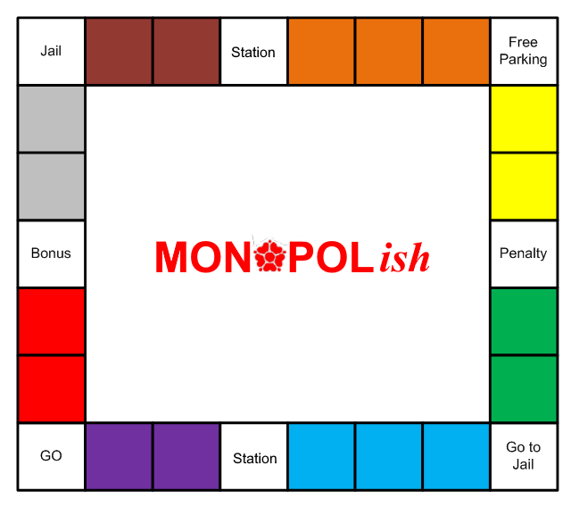

# MONOPOL*ish*

![GPLv2][license-badge]

> For this assignment, you will work towards implementing a simplified version of the classic board
> game Monopoly. This is not an interactive game you can play, but rather a simulation of two players
> taking turns over a set number of rounds. Play is to be automated according to a sequence of pseudo-
> random numbers - there is no artificial intelligence, and no user input. All output will be text based
> and directed towards the console – there are no graphical elements to this assignment.

## Authorship

**Jacob Sanchez Perez \<jsanchez-perez@uclan.ac.uk>**

## License

![GPLv2][license-badge]

This software is distributed under the [General Public License v2.0][license], more information available at the [Free Software Foundation][gnu].

[uclan]: https://uclan.ac.uk

[license]: LICENSE "General Public License"
[gnu]: https://www.gnu.org/licenses/old-licenses/gpl-2.0.html "Free Software Foundation"

[license-badge]: https://img.shields.io/github/license/jacobszpz/Monopol-ish